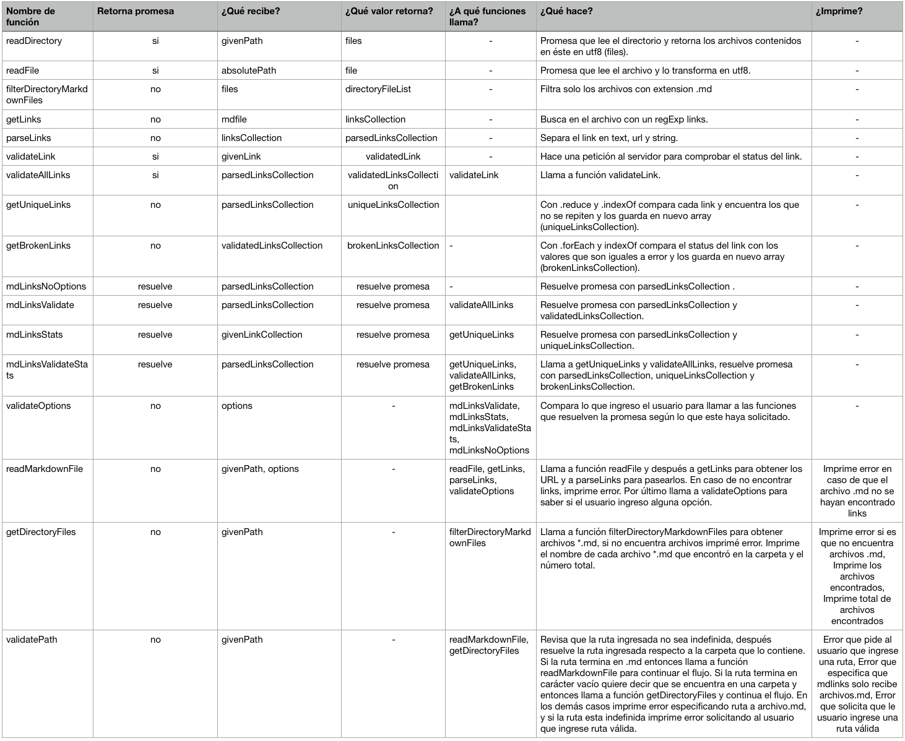

# Markdown Links

## Descripción del módulo

MD-Links es una librería cuya principal función es leer y analizar archivos en formato `Markdown` (*.md), para verificar el estado de los enlaces o ligas que contiene y reportar cuantos encontró, cuantos enlaces están rotos y cuantos son únicos.

## Documentación

### Requerimientos previos

- [node.js](https://nodejs.org/en/download/)

### Instalación

Este módulo se instala desde la terminal, en donde será necesario escribir el siguiente comando para iniciar la instalación:

```sh


$ npm install mariabp-md-links


```

Al presionar enter, se instalará la librería y las dependencias necesarias para que esta funcione correctamente.


## Funcionamiento


### JavaScript API


El módulo puede importarse en otros scripts de Node.js y debe ofrece la siguiente interfaz:


#### `mdLinks(path, options)`


##### Argumentos


- `path`: Ruta absoluta o relativa al archivo o directorio. Si la ruta pasada es relativa, se resuelve con respecto al directorio desde donde se invoca.


- `options`: Un objeto con las siguientes propiedades:


- `--validate`: Booleano que determina si se desea validar los links encontrados.

- `--stats`: Booleano que determina si se desea obtener las siguientes estadísticas de los enlaces:

	- Total de enlaces encontrados.

	- Total de enlaces únicos encontrados.

- `--validate --stats`: Booleano que determina si se desea obtener las siguientes estadísticas de los enlaces:

	- Total de enlaces únicos encontrados.

	- Total de enlaces rotos encontrados

	- Total de enlaces encontrados.


##### Valor de retorno


La función retorna una promesa (`Promise`) que resuelva a un arreglo (`Array`) de objetos (`Object`), donde cada objeto representa un link y contiene las siguientes propiedades:

- `href`: URL encontrada.


- `text`: Texto que aparecía dentro del link (`<a>`).


- `file`: Ruta del archivo donde se encontró el link.


### CLI (Command Line Interface - Interfaz de Línea de Comando)


El ejecutable de nuestra aplicación se ejecuta de la siguiente manera a través de la terminal:


`md-links <path-to-file> [options]`


Por ejemplo:

```sh
user$ md-links /path/archivo.md

	    Path: /Users/user/path/archivo.md

        [link text] https://algunurl.com
        [link text] https://algunotrourl.com

                2 link(s) found in total.

```


El comportamiento por defecto no valida si las URLs responden ok o no, solo debe identifica el archivo markdown (a partir de la ruta que recibe como

argumento), analiza el archivo Markdown e imprimé los links que vaya encontrando, junto con la ruta del archivo donde aparece y el texto que hay dentro del link.


#### Options


##### `--validate`

Si pasamos la opción `--validate`, el módulo hace una petición HTTP para averiguar si el link funciona o no. Si el link resulta en una redirección a una URL que responde ok, entonces consideramos el link como OK.

Por ejemplo:


```sh
user$ md-links /path/archivo.md --validate

	    Path: /Users/user/path/archivo.md

        [link text] https://algunurl.com ( 200 OK )
        [link text] https://algunotrourl.com ( 404 Not Found )

                2 link(s) found in total.

```
Vemos que el _output_ en este caso incluye la palabra `ok` o `fail` después de la URL, así como el status de la respuesta recibida a la petición HTTP a dicha URL.

##### `--stats`

Si pasamos la opción `--stats` el output (salida) será un texto con estadísticas básicas sobre los links.

```sh
user$ md-links /path/archivo.md --stats

                Path: /Users/user/path/archivo.md

                6 unique link(s) found in total.
                10 link(s) found in total.

```


También podemos combinar `--stats` y `--validate` para obtener estadísticas que necesiten de los resultados de la validación.

  ```sh
user$ md-links /path/archivo.md --stats

                Path: /Users/user/path/archivo.md

                6 unique link(s) found in total.
                1 broken link(s) found in total.
                10 link(s) found in total.

```


## Diagrama de Flujo Markdown Links


## Funciones Markdown Links

A continuación se describen las funciones que conforman mdlinks:

